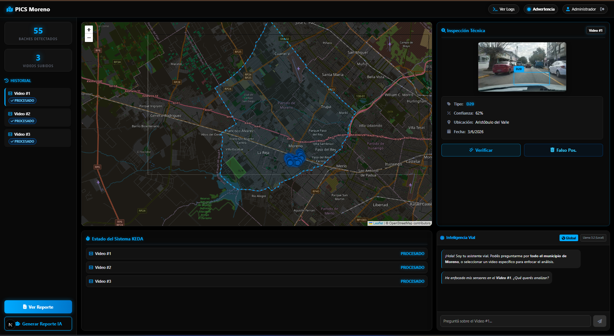
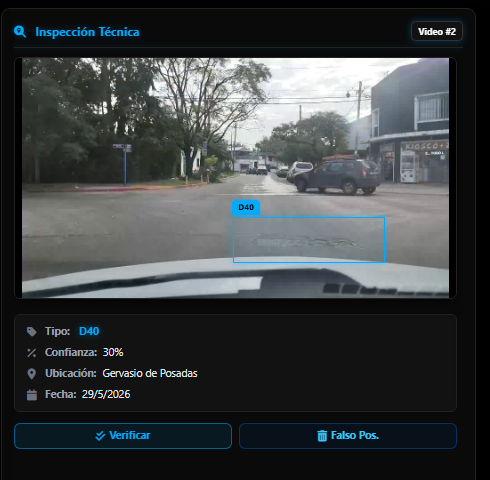

# PICS
## Sistema de Mapeo Dinámico del Estado Vial

  Transformando la infraestructura urbana con Inteligencia Artificial

  Municipio de Moreno | Presentación Ejecutiva

---
layout: default
class: bg-black text-white
---

# El desafío actual en la gestión pública

El mantenimiento de la red vial enfrenta limitaciones históricas que cuestan tiempo y recursos.

  

    <h3 class="text-[#00aaff] text-xl mb-2"><carbon-time class="inline-block mr-2"/> Relevamientos Lentos</h3>
    
Las inspecciones manuales son costosas, requieren mucho personal y tardan meses en cubrir todo el municipio.

  

  

    <h3 class="text-[#00aaff] text-xl mb-2"><carbon-warning-alt class="inline-block mr-2"/> Subjetividad</h3>
    
La catalogación del daño depende del criterio del inspector. No hay métricas estandarizadas.

  

  

    <h3 class="text-[#00aaff] text-xl mb-2"><carbon-map class="inline-block mr-2"/> Falta de Datos Georreferenciados</h3>
    
La toma de decisiones presupuestarias se hace "a ciegas", sin un mapa actualizado en tiempo real.

  

  

    <h3 class="text-[#00aaff] text-xl mb-2"><carbon-network-4 class="inline-block mr-2"/> Desconexión</h3>
    
Falta de herramientas integradas que conecten la calle directamente con el escritorio del Secretario de Obras Públicas.

  

---
layout: default
class: bg-[#050505] text-white
---

# La solución: 
# ¿Qué es el sistema de mapeo dinámico del estado vial?

  Una plataforma integral que automatiza el relevamiento de calles utilizando cámaras de smartphones en vehículos municipales, procesando todo con IA en la nube.

  

    
<carbon-video/>

    <h3 class="font-bold mb-2">Captura Móvil</h3>
    
App web que graba video y GPS desde cualquier vehículo, preparada para zonas sin señal.

  

  
  

    
<carbon-machine-learning-model/>

    <h3 class="font-bold mb-2">Análisis IA</h3>
    
Detecta baches y grietas automáticamente. Unifica daños cercanos para evitar alertas duplicadas.

  

  

    
<carbon-dashboard/>

    <h3 class="font-bold mb-2">Gestión y Reportes</h3>
    
Dashboard interactivo con mapas y reportes generados por un asistente virtual inteligente.

  

---
layout: image-right
image: https://images.unsplash.com/photo-1517404215738-15263e9f9178?q=80&w=2070&auto=format&fit=crop
class: bg-black text-white
---

# PozoCam: Los ojos del Sistema

  La recolección no requiere hardware costoso. Operamos sobre los parabrisas con celulares de los empleados municipales.

<ul class="space-y-3 text-sm text-gray-300 leading-snug">
  <li v-click>
    <strong class="text-[#00aaff] block mb-0.5">Resiliencia Offline:</strong> 
    Guarda todo localmente y sube los datos solo al recuperar la conexión estable.
  </li>
  <li v-click>
    <strong class="text-[#00aaff] block mb-0.5">Subida Multipartes:</strong> 
    Si se corta internet a la mitad, no se pierde el video; el sistema retoma exactamente desde el último fragmento.
  </li>
  <li v-click>
    <strong class="text-[#00aaff] block mb-0.5">Telemetría Exacta:</strong> 
    Sincronización de GPS para ubicar exactamente en qué metro cuadrado está el bache.
  </li>
</ul>

---
layout: default
class: bg-[#050505] text-white
---

# Inteligencia Artificial de Frontera

No solo vemos la calle, **la entendemos**. Nuestro motor de visión computacional garantiza precisión y seguridad ciudadana.

  

    <h3 class="text-xl font-bold mb-4 border-b border-[#333] pb-2 text-white">Detección Precisa</h3>
    <ul class="space-y-3 text-sm text-gray-400">
      <li v-click>Tres categorías clave: Baches, Grietas y Calles de Tierra.</li>
      <li v-click>Cero Duplicados: La IA sabe si un auto pasó dos veces por el mismo pozo. Actualiza la foto con la mejor calidad en vez de duplicar alertas.</li>
      <li v-click>Filtro Inteligente: Ignora automáticamente el cielo, árboles o aves para concentrarse solo en la calzada.</li>
    </ul>
  

  
  

    

      
<carbon-security class="text-[#00aaff]"/>

      <h3 class="text-xl font-bold text-white mb-2">Privacidad por Diseño</h3>
      

        Cumplimos con las normativas de protección de datos. Antes de que cualquier imagen llegue al servidor municipal, una segunda IA <strong>difumina automáticamente rostros de peatones y patentes de vehículos</strong>.
      

    

  

---
layout: default
class: bg-black text-white
---

# Dashboard Municipal y Asistente Virtual

Pasamos de tener un "mapa lleno de puntos" a tener un **mapa de decisión estratégica**.

  <ul class="space-y-4 text-sm text-gray-300">
    <li v-click>
      <strong class="text-[#00aaff] text-base block mb-1">Mapa Interactivo</strong>
      Visualice todo el municipio y seleccione cualquier calle para inspeccionar la calzada.
    </li>
    <li v-click>
      <strong class="text-[#00aaff] text-base block mb-1">Auditoría Human-in-the-Loop</strong>
      Los inspectores revisan las alertas generadas por la IA, descartando falsos positivos. Sirviendo estas para reentrenar el modelo para que no vuelva a equivocarse.
    </li>
    <li v-click>
      <strong class="text-[#00aaff] text-base block mb-1">Reportes Ejecutivos por IA</strong>
      Un modelo de lenguaje privado redacta informes técnicos formales listos para licitaciones u órdenes de trabajo, priorizando obras cerca de escuelas u hospitales.
    </li>
  </ul>

  

    
  

---
layout: default
class: bg-[#050505] text-white
---

# Centro de Control Inteligente

Visión consolidada del estado de la infraestructura vial del Municipio de Moreno.

  

---
layout: center
class: bg-black text-white text-center
---

# Ciclo de valor

  

    
<carbon-car/>

    1. Captura Móvil
  

  

  

    
<carbon-cloud-upload/>

    2. Subida Segura
  

  

  

    
<carbon-settings/>

    3. Análisis y Privacidad
  

  

  

    
<carbon-report/>

    4. Reporte y Acción
  

  Un proceso totalmente desatendido. El inspector graba, el sistema procesa, consolida, prioriza y entrega soluciones listas para la toma de decisiones.

---
layout: default
class: bg-[#050505] text-white
---

# ¿Por qué elegir el Sistema de mapeo dinámico del estado vial ?

  

    <h3 class="text-[#00aaff] text-xl font-bold mb-2">Escalabilidad Cloud</h3>
    
Arquitectura desplegada en Google Cloud. Auto-escalable: Si no hay videos subiéndose, los servidores de IA se apagan para ahorrar presupuesto municipal.

  

  

    <h3 class="text-[#00aaff] text-xl font-bold mb-2">Costos Reducidos</h3>
    
No requiere hardware especializado (Hardware o vehículos costosos). Utiliza la flota actual del municipio y cámaras celulares.

  

  

    <h3 class="text-[#00aaff] text-xl font-bold mb-2">Mejora Continua</h3>
    
El sistema no queda obsoleto. Con cada auditoría, la IA se podrá reentrenar automáticamente para mejorar.

  

  

    <h3 class="text-[#00aaff] text-xl font-bold mb-2">Transparencia de Gestión</h3>
    
Datos objetivos y respaldados con fotografías y GPS para justificar presupuestos de obras públicas frente a los ciudadanos.

  

---
layout: center
class: bg-black text-white text-center
---

<h1 class="text-5xl font-black mb-4">Proyecto Integrador de Ciencias de Datos - 11285 Universidad Nacional de Luján.</h1>

  
¿Preguntas?

  
Kelechian, Leonardo

  
Coyra, Federico

  <carbon-arrow-down/>

