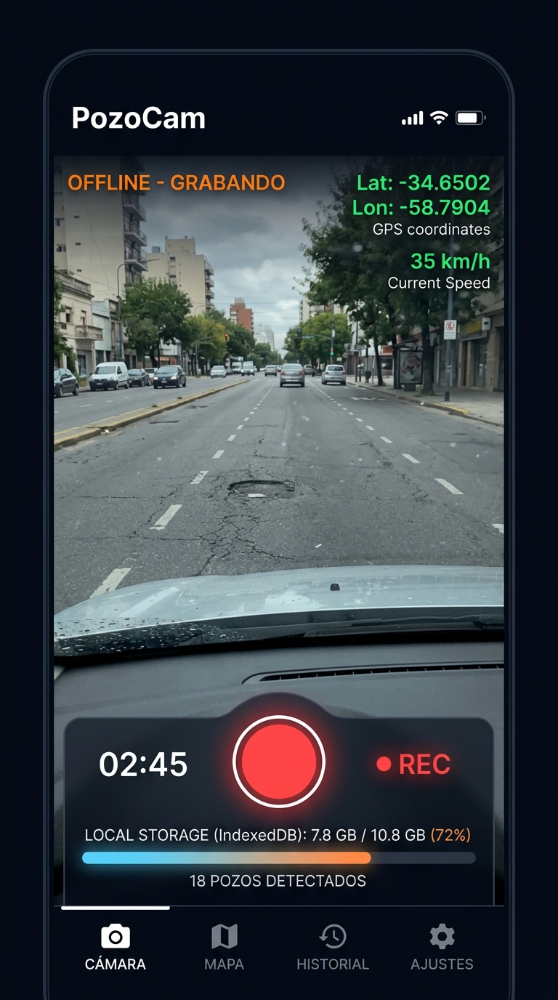
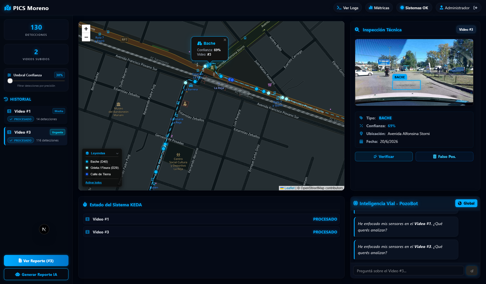
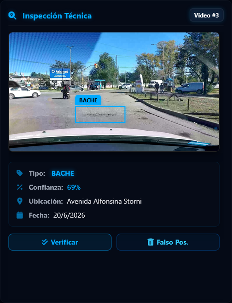

# Sistema de Mapeo Dinámico Vial

  Transformando la infraestructura urbana con Inteligencia Artificial

<!-- 

  Presentación

 -->

---
layout: default
---

# El desafío actual en la gestión pública

El mantenimiento de la red vial enfrenta limitaciones históricas que cuestan tiempo y recursos.

  

    <h3 class="text-[#00aaff] text-xl mb-2"><carbon-time class="inline-block mr-2 text-[#00aaff]"/> Relevamientos Lentos</h3>
    
Las inspecciones manuales son costosas, requieren mucho personal y tardan meses en cubrir todo el municipio.

  

  

    <h3 class="text-[#00aaff] text-xl mb-2"><carbon-warning-alt class="inline-block mr-2 text-[#00aaff]"/> Subjetividad</h3>
    
La catalogación del daño depende del criterio del inspector. No hay métricas estandarizadas.

  

  

    <h3 class="text-[#00aaff] text-xl mb-2"><carbon-map class="inline-block mr-2 text-[#00aaff]"/> Falta de Datos Georreferenciados</h3>
    
La toma de decisiones presupuestarias se hace "a ciegas", sin un mapa actualizado en tiempo real.

  

  

    <h3 class="text-[#00aaff] text-xl mb-2"><carbon-network-4 class="inline-block mr-2 text-[#00aaff]"/> Desconexión</h3>
    
Falta de herramientas integradas que conecten la calle directamente con el escritorio del Secretario de Obras Públicas.

  

---
layout: default
---

# Comparativa de Procesos: Tradicional vs. Dinámico

¿Cómo transformamos un proceso manual costoso en una solución automática eficiente?

  

    <h3 class="text-slate-400 text-lg font-bold mb-2.5 flex items-center gap-2">
      <carbon-warning-alt class="text-xl text-slate-400"/> Relevamiento Tradicional
    </h3>
    <ul class="space-y-1.5 text-xs text-gray-400">
      <li><strong>Planillas Manuales:</strong> Inspectores a pie o en vehículo anotando datos a mano.</li>
      <li><strong>Criterio Subjetivo:</strong> La gravedad del bache depende de la opinión de cada inspector.</li>
      <li><strong>Lento e Ineficiente:</strong> Semanas de trabajo administrativo para digitalizar y analizar.</li>
      <li><strong>Costoso y Estático:</strong> Red desactualizada; la red vial se degrada más rápido de lo que se mide.</li>
    </ul>
  

  

    <h3 class="text-[#00aaff] text-lg font-bold mb-2.5 flex items-center gap-2">
      <carbon-checkmark class="text-xl text-[#00aaff]"/> Relevamiento Dinámico
    </h3>
    <ul class="space-y-1.5 text-xs text-gray-300">
      <li><strong>Mapeo Pasivo:</strong> Celular en parabrisas de vehículos en ruta habitual (camión de basura, patrullas).</li>
      <li><strong>Objetividad con IA:</strong> Visión computacional estandariza severidades sin error humano.</li>
      <li><strong>Procesamiento Cloud:</strong> Alertas y reportes consolidados automáticamente en el día.</li>
      <li><strong>Costo de Hardware $0:</strong> Aprovecha recursos existentes de forma continua y escalable.</li>
    </ul>
  

  Métrica de Impacto: Reducción del <strong>90%</strong> en tiempos de relevamiento de toda la infraestructura vial municipal.

---
layout: default
---

# La solución: ¿Qué es el sistema de mapeo dinámico del estado vial?

  Una plataforma integral que automatiza el relevamiento de calles utilizando cámaras de smartphones en vehículos municipales, procesando todo con IA en la nube.

  

    
<carbon-video/>

    <h3 class="font-bold mb-2 text-[#00aaff]">Captura Móvil</h3>
    
App web que registra video y telemetría de coordenadas desde cualquier vehículo, optimizada para zonas sin señal.

  

  
  

    
<carbon-machine-learning-model/>

    <h3 class="font-bold mb-2 text-[#00aaff]">Análisis IA</h3>
    
Detecta baches y grietas automáticamente. Unifica daños cercanos mediante criterios geoespaciales.

  

  

    
<carbon-dashboard/>

    <h3 class="font-bold mb-2 text-[#00aaff]">Gestión y Reportes</h3>
    
Dashboard interactivo con mapas y reportes generados por un asistente virtual inteligente.

  

---
layout: default
---

# PozoCam: Los ojos del Sistema

  La recolección no requiere hardware costoso. Operamos sobre los parabrisas con celulares de los empleados municipales.

<ul class="space-y-3 text-sm text-gray-300 leading-snug">
<li v-click>
  <strong class="text-[#00aaff] block mb-0.5">Resiliencia Offline:</strong>
  Guarda todo localmente y sube los datos solo al recuperar la conexión estable.
</li>
<li v-click>
  <strong class="text-[#00aaff] block mb-0.5">Subida Multipartes:</strong>
  Si se corta internet a la mitad, no se pierde el video; el sistema retoma exactamente desde el último fragmento.
</li>
<li v-click>
  <strong class="text-[#00aaff] block mb-0.5">Telemetría Exacta:</strong>
  Sincronización geoespacial para ubicar con precisión dónde se encuentra cada anomalía.
</li>
</ul>

  

---
layout: default
---

# Inteligencia Artificial de Frontera

No solo vemos la calle, **la entendemos**. Nuestro motor de visión computacional garantiza precisión y seguridad ciudadana.

  

    <h3 class="text-xl font-bold mb-4 border-b border-white/10 pb-2 text-[#00aaff]">Detección Precisa</h3>
    <ul class="space-y-3 text-sm text-gray-400">
      <li v-click>Tres categorías clave: Baches, Grietas y Calles de Tierra.</li>
      <li v-click>Cero Duplicados: El sistema agrupa capturas sucesivas de un mismo daño en un recorrido, consolidando la alerta y conservando solo la imagen con mayor nitidez.</li>
      <li v-click>Filtro Inteligente: Ignora automáticamente el cielo, árboles o aves para concentrarse exclusivamente en la calzada.</li>
    </ul>
  

  
  

    

      
<carbon-security class="text-[#00aaff]"/>

      <h3 class="text-xl font-bold text-[#00aaff] mb-2">Privacidad por Diseño</h3>
      

        Cumplimos con las normativas de protección de datos. Antes de que cualquier imagen se almacene en el servidor municipal, el sistema <strong>difumina automáticamente rostros de peatones y patentes de vehículos</strong>.
      

    

  

---
layout: default
---

# Dashboard Municipal y Asistente Virtual

Pasamos de tener un "mapa lleno de puntos" a tener un **mapa de decisión estratégica**.

  <ul class="space-y-3 text-xs text-gray-300 leading-snug">
    <li v-click>
      <strong class="text-[#00aaff] text-sm block mb-0.5">Priorización con Sentido Social (OSM)</strong>
      Cruza automáticamente los daños detectados con paradas de colectivo, escuelas y hospitales (OpenStreetMap).
       <strong>Diferencial:</strong> Repara primero los daños de mayor rentabilidad y uso social.
    </li>
    <li v-click>
      <strong class="text-[#00aaff] text-sm block mb-0.5">Control Humano (Human-in-the-Loop)</strong>
      Los inspectores validan o descartan falsos positivos generados por la IA.
       <strong>Diferencial:</strong> Mantiene el criterio experto y reentrena al modelo continuamente.
    </li>
    <li v-click>
      <strong class="text-[#00aaff] text-sm block mb-0.5">Automatización de Reportes e Informes</strong>
      El Asistente Virtual (LLM) redacta informes técnicos con vocabulario formal de obra pública.
       <strong>Diferencial:</strong> Ahorra tiempo de oficina; reportes de bacheo listos en minutos.
    </li>
  </ul>

  

    
  

---
layout: default
---

# Centro de Control Inteligente

Visión consolidada del estado de la infraestructura vial del Municipio de Moreno.

  

---
layout: center
class: text-center
---

# Ciclo de valor

  

    
<carbon-car/>

    1. Captura Móvil
  

  

  

    
<carbon-cloud-upload/>

    2. Subida Segura
  

  

  

    
<carbon-settings/>

    3. Análisis y Privacidad
  

  

  

    
<carbon-report/>

    4. Reporte y Acción
  

  Un proceso integrado que transforma el recorrido diario de un vehículo municipal en <strong>reportes técnicos formales y mapas de priorización social</strong>, listos para la planificación y ejecución inmediata de obras de bacheo.

---
layout: default
---

# ¿Por qué elegir el Sistema de Mapeo Dinámico del Estado Vial ?

  

    <h3 class="text-[#00aaff] text-lg font-bold mb-1.5 flex items-center gap-2">
      <carbon-report class="text-xl"/> Automatización de Reportes
    </h3>
    
El asistente de IA redacta informes técnicos de obras de bacheo en minutos, reduciendo drásticamente la carga de trabajo y el tiempo administrativo de la oficina.

  

  

    <h3 class="text-[#00aaff] text-lg font-bold mb-1.5 flex items-center gap-2">
      <carbon-wallet class="text-xl"/> Costos Reducidos
    </h3>
    
No requiere vehículos equipados ni hardware costoso. Utiliza smartphones estándar montados en la flota municipal existente (recolectores, patrullas).

  

  

    <h3 class="text-[#00aaff] text-lg font-bold mb-1.5 flex items-center gap-2">
      <carbon-map class="text-xl"/> Priorización Social
    </h3>
    
Cruce automático con OpenStreetMap para priorizar reparaciones a menos de 50m de escuelas y hospitales, optimizando la asignación con criterio de rentabilidad social.

  

  

    <h3 class="text-[#00aaff] text-lg font-bold mb-1.5 flex items-center gap-2">
      <carbon-analytics class="text-xl"/> Transparencia de Gestión
    </h3>
    
Evidencia objetiva georreferenciada con registro fotográfico e histórico. Permite auditar y rendir cuentas de las obras públicas de forma abierta al ciudadano.

  

---
layout: center
class: text-center
---

<h1 class="text-5xl font-black mb-4">Proyecto Integrador de Ciencias de Datos - 11285 Universidad Nacional de Luján</h1>

  
¿Preguntas?

  
Kelechian, Leonardo

  
Coyra, Federico

  <carbon-arrow-down/>

